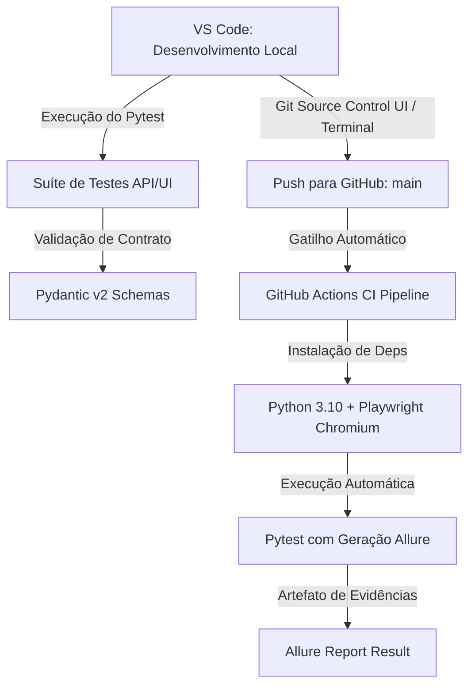

# Verzel Store — Plano de Engenharia e Automação de QA (VZS-142)

Este repositório contém a suíte de testes automatizados (API e UI) e o planejamento estratégico de garantia da qualidade para a entrega **VZS-142 (Cupons de Desconto e Frete Grátis)** da Verzel Store.

---

## 1. Arquitetura do Fluxo Git, VS Code e CI/CD



---

## 2. Cobertura BDD e Regras de Negócio (CA01 a CA11)

| Critério | Descrição Resumida | Tipo de Teste | Status |
| :--- | :--- | :--- | :--- |
| **CA01/CA02** | Desconto 10% `BEMVINDO10` + Sanitização (Trim/Case Insensitive) | API & UI | `COBERTO` |
| **CA03** | Cupom inexistente exibe "Cupom inválido." sem aplicar desconto | API & UI | `COBERTO` |
| **CA04** | Cupom expirado (`VERAO2026`) exibe "Cupom expirado." | API & UI | `COBERTO` |
| **CA05** | Apenas um cupom por vez no carrinho | UI E2E | `COBERTO` |
| **CA06/CA08** | Frete grátis para subtotal $\ge$ R$ 200,00 (antes do desconto) | API | `COBERTO` |
| **CA07** | Frete fixo R$ 19,90 e cálculo do valor faltante para frete grátis | API & UI | `COBERTO` |
| **CA09** | Desconto do cupom incide apenas sobre subtotal dos produtos | API | `COBERTO` |
| **CA10** | Limite máximo de 5 unidades por produto | API BVA | `COBERTO` |
| **CA11** | Arredondamento exato em 2 casas decimais | API Schema | `COBERTO` |

---

## 3. Instruções de Execução Local

### Pré-requisitos
* Python 3.10+
* VS Code

### Passo a Passo
1. Abra o terminal integrado no VS Code (`Ctrl + '`).
2. Ative o ambiente virtual e instale as dependências:
   ```powershell
   .\venv\Scripts\Activate.ps1
   pip install -r requirements.txt
   playwright install chromium
   ```
3. Executar os testes:
   ```powershell
   pytest -v --alluredir=allure-results
   ```
4. Visualizar o relatório Allure:
   ```powershell
   allure serve allure-results
   ```